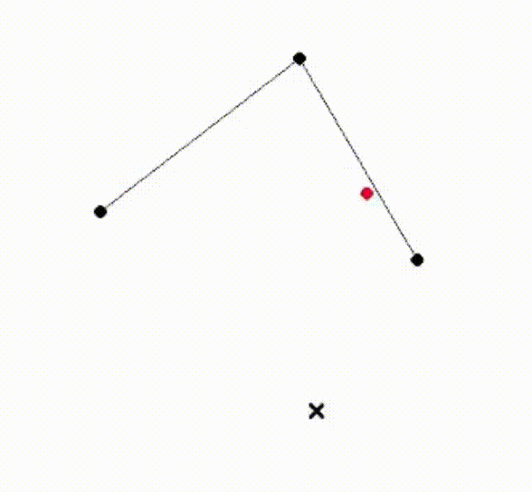

# Random things

### Bezier -- bezier curve in Haskell with Gloss

to run it, go into the project directory and do `cabal run`

place points with left click, when you have at least two points it will start rendering the bezier curve between them

to clear the points press C

to exit press ESCAPE




### Huffman.hs - an implementation of Huffman coding in Haskell

To encode things use `huffmanEncode x`, where `x` is the string/list to encode.

To decode things use `huffmanDecode encoded ht`, where `encoded` are the encoded bits in a String and `ht` is the HuffmanTable that was used for encoding.

`huffmanTable` returns the encryption table and `huffman` returns the binary tree of the table.

example, encoding the text "hello world!" and then decoding it with the table and bits:

```haskell
$ ghci Huffman.hs

> encoded = huffmanEncode "hello world!"
> encoded
"0011100010110111111001010000111011110"

> ht = huffmanTable "hello world!"
> ht
[('l',"01"),('r',"000"),('h',"001"),('w',"100"),('o',"101"),('e',"1100"),('d',"1101"),('!',"1110"),(' ',"1111")]

> huffmanDecode encoded ht
"hello world!"
```


### Bf.hs - very basic brainf*ck interpreter

just interpret a file with `runghc Bf.hs file.bf`

or run a repl with `runghc Bf.hs`

example:

```console
$ runghc Bf.hs
> ++++++++[>++++[>++>+++>+++>+<<<<-]>+>+>->>+[<]<-]>>.>---.+++++++..+++.>>.<-.<.+++.------.--------.>>+.>++.
Hello World!
```
